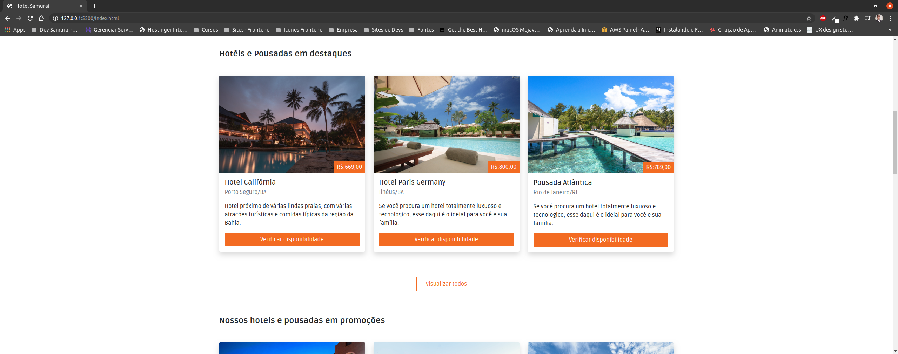
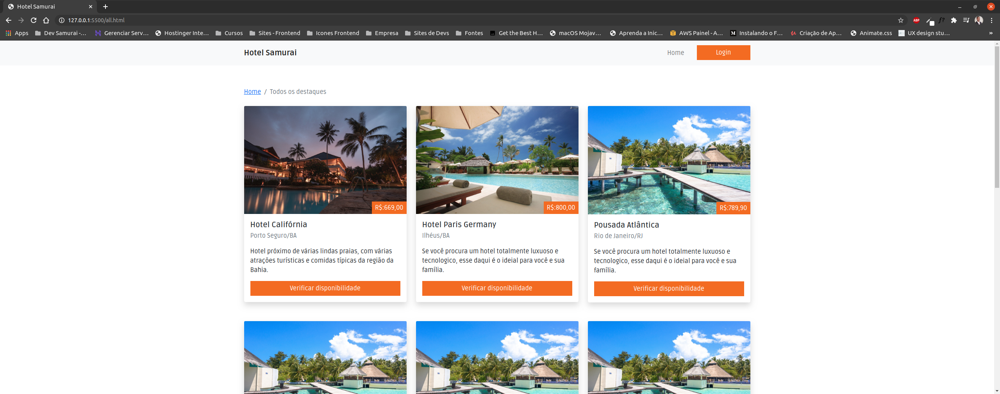
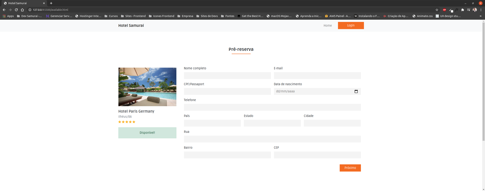

# WAAF Hotels
Hey, how you doing?
You around here? Now I'm really happy. Enjoy my repositories there!

## About the project

The idea of the project is develop an application (template) totally focused on tourism companies, that is, that provide accommodation options for the final user.

In this application it is possible for the company to register, for example, its hotels and inns, and the client through this platform will be able to do a search of the best options taking into account the benefits of each one of them as well as the price to be paid.

The technologies that are being used in this project are:

[x] Bootstrap (V5).
[x] CSS.
[x] JavaScript.

Segue abaixo alguns screenshots do projeto:

Note: This project was done with the aim of training CSS skills.
